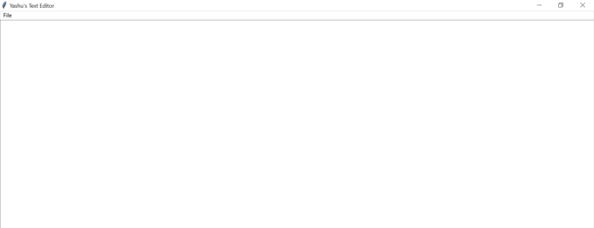

# 📝 Text Editor using Python (Tkinter)

A simple and functional Text Editor built using Python and Tkinter.  
This project demonstrates GUI development, file handling, and user-friendly features like Dark Mode.

---

## 🚀 Features

- 📄 Create a new file  
- 📂 Open existing text files  
- 💾 Save files  
- ⌨️ Keyboard shortcuts (Ctrl + N, Ctrl + O, Ctrl + S)  
- ❗ Exit confirmation dialog  
- 🌙 Dark Mode toggle  

---

## 🛠️ Technologies Used

- Python  
- Tkinter (GUI Library)

---

## 📸 Screenshots

